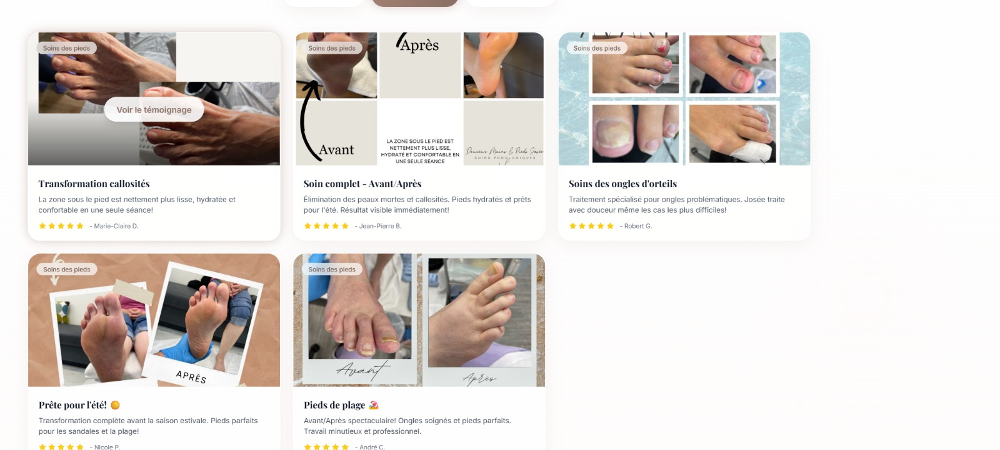
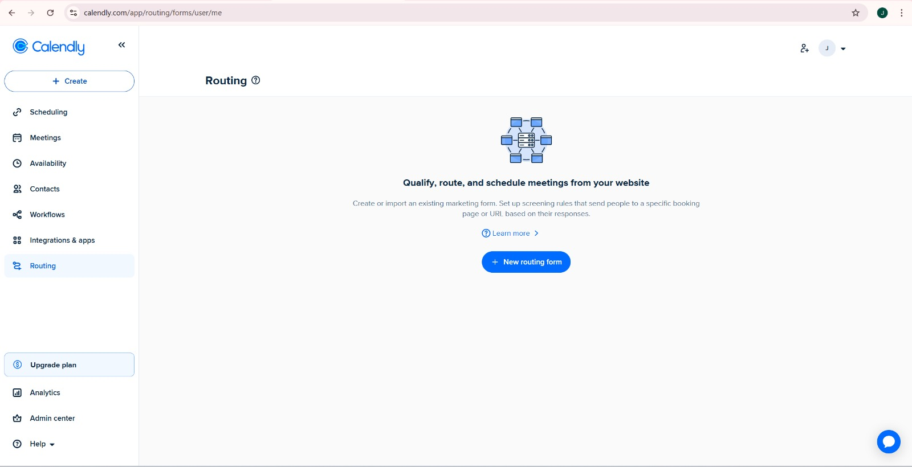

# Session Notes - Project Josee

## Date: 2026-02-17

- **UI Privacy Update:**
  - Sur les cartes de témoignage (Photos Avant/Après), ne pas afficher le nom complet du client.
  - Afficher uniquement les **2 premières initiales** (ex: "Marie-Claire D." -> "M. D." ou "M.C.").
  - *Note : L'image montre "Marie-Claire D.", "Jean-Pierre B.", "Robert G.". L'utilisateur veut probablement plus court encore.*
  - Référence visuelle : `assets/screenshots/initials_privacy_request.jpg`

- **Calendly Routing Integration:**
  - Configurer un "Routing Form" dans Calendly pour filtrer les RDV.
  - **Choix utilisateur :** À Domicile vs Au Local.
  - **Logique :** Rediriger vers le bon calendrier (ou type d'événement) selon la réponse.
  - **Intégration Site :** Le bouton "Prendre RDV" du site devra ouvrir ce formulaire de routage au lieu du lien direct actuel.
  - Référence visuelle : `assets/screenshots/calendly_routing.jpg`

